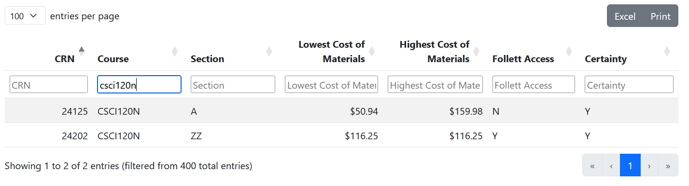
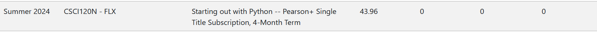
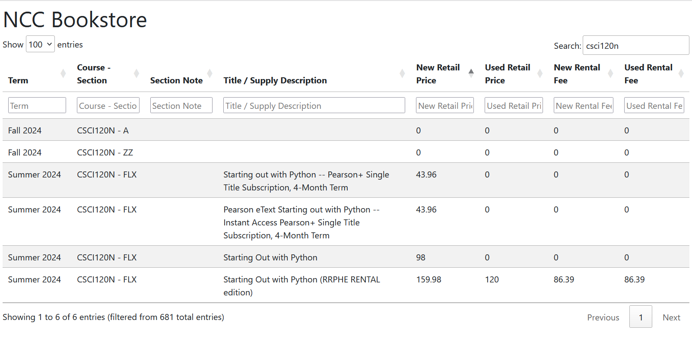
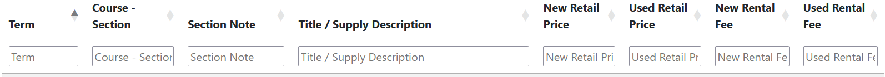
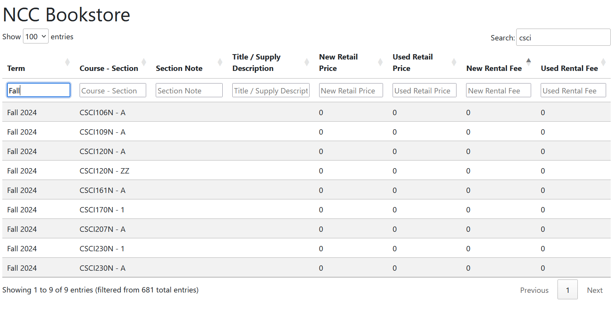

# cost-of-materials
HEOA Cost of Materials  
By Strawb Smith

## Contents

- [Disclaimer](#disclaimer)
- [Objective](#objective)
- [How To](#how-to)
- [Credits](#credits)

## Disclaimer

This data is provided by Follett and reflects the current state of the NCC adoptions  
for the current and 2 future semesters.  
Future semesters will have incomplete data. Some course materials may not be listed here,  
please check with the instructors or look in Canvas. The data is updated every 24 hours.  
  
Bear in mind materials purchased through Follett Access are paid as fees to NCC rather than purchases from the bookstore.

## Objective

This webpage is designed to assist teachers and staff with finding the expenses of materials
in a given semester.

## How To

Enter the section identifier in the search box. For example: csci20n

To see all sections, enter the course, do not include a course code,  
only use the course short hand. For example, csci, which is short for Computer Science.

See also the selector on the top left, this lets you decide how many rows to display.

The results automatically appear below, no need to press enter.

Make sure to read over the title section and section note.  
The section note may contain info on whether the book is provided  
for free via openstax or another venue.  
The Title can provide context to whether a book is digital or physical.  
The prices listed are based on the digital or physical book's sale options.  

For example: csci120n - flx has a listing for a Pearson+ copy of the textbook.  
The singular price is its rental fee via Pearson+

If you want to sort the results by lowest price, clicking a column header, such as New Retail Price,  
will sort the new retail prices in ascending order, showing cheapest, or zero, first.

Additionally, if you want to search a specific column, see the search bars under each column title.  
Those will search specifically for details within that column.

The table will contain information of multiple semesters at any given time. To exclusively look for a  
desired semester. Use the search bar under Term, enter the season, year, or both.

## Credits

The table's visual style, format, and search engine  
were provided by [Datatables.net](https://datatables.net/)  
Big shoutout to Datatables for their designs.