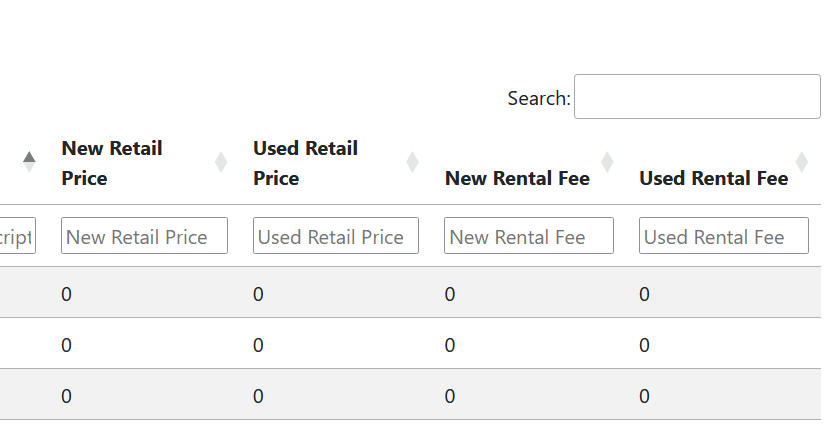
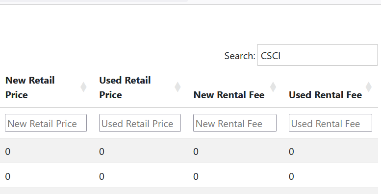
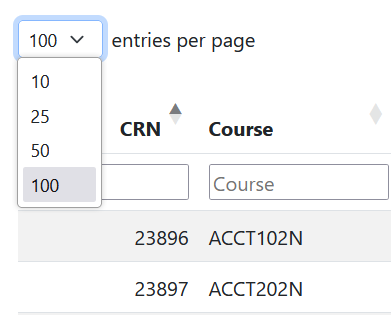
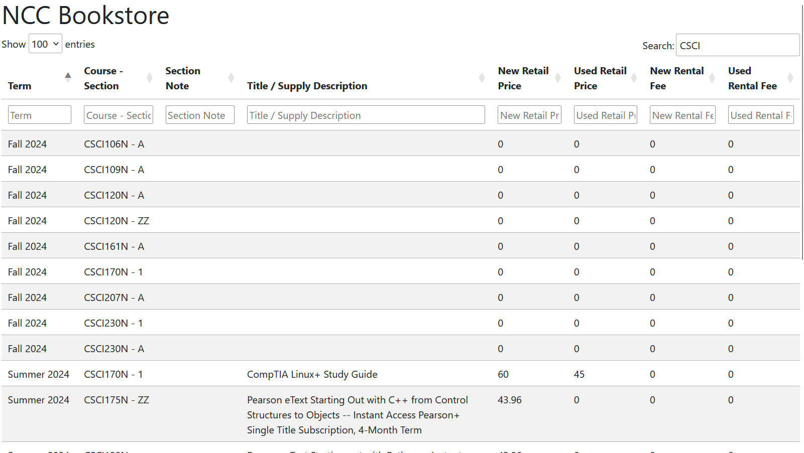

# cost-of-materials
HEOA Cost of Materials  
By Strawb Smith

## Contents

- [Disclaimer](#disclaimer)
- [Objective](#objective)
- [Cost Selection](#cost-selection)
- [How To](#how-to)

## Disclaimer

The table's visual style, format, and search engine  
were provided by [Datatables.net](https://datatables.net/)  
Big shoutout to Datatables for their designs.

## Objective

This webpage is designed to assist teachers and staff with finding the expenses of materials
in a given semester.  
Openly and cleanly presenting the facts. This is not an estimation,
it is collecting data from Follett.  
Please take the time to read the data and compare responsibly.

## Cost Selection

This table in particular curates the data from Follett to be strictly what is useful  
for answering questions about the cost of materials.  
To do so:  

1. it reads in the entire file.
1. Then initializes a curated array, and begins to scan the document.
1. Per line, it segments the data into elements, and then puts them onto an array.
1. Once the line is complete, the data points have all been turned into elements in an array. 
1. The array is pushed onto the curated array, making the curated array a 2 dimensional array.
1. The curated array is imploded within the html. 

Since the data is already separated, it easily falls into place on the table, producing the result seen on the browser.

## How To

Note the search bar in the top right, select it.

Enter the acronym of the course you want to view.

See also the selector on the top left, this lets you decide how many rows to display.

The results automatically appear below, no need to press enter.

Additionally, if you want to search a specific column, see the search bars under each column title.  
Those will search specifically for details within that column.
