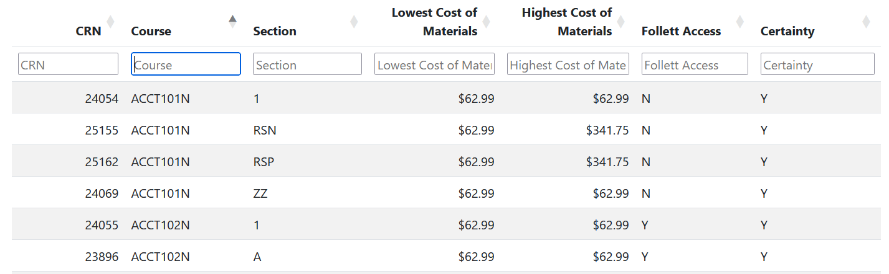

# cost-of-materials
HEOA Cost of Materials  
By Strawb Smith

## Contents

- [Disclaimer](#disclaimer)
- [Objective](#objective)
- [How To](#how-to)
- [Credits](#credits)

## Disclaimer

This data is provided by Follett and reflects the current state of the NCC adoptions  
for the current and 2 future semesters.  
Future semesters will have incomplete data. Some course materials may not be listed here,  
please check with the instructors or look in Canvas. The data is updated every 24 hours.  
  
Bear in mind materials purchased through Follett Access are paid as fees to NCC rather than purchases from the bookstore.

## Objective

This webpage is designed to assist staff with 
determining low and no costcourse material.

## How To

Select the Semester, note how the page opens on the current semester.  

The table below has search bars allows you to search within each column.  

Select the arrows next to a column header to sort by that column.  

In the top left, select how many rows to display.  
  

If a section's materials have no cost, or are not required, 
the row displays green. These are no cost courses.  

The Certainty boolean:  
Within the program, Professor Gamrat and I developed a
"guesstimator" to determine if materials are the same as
each other, as the listed titles include needless extra 
data that will confuse any simple comparison.  
However, the validity of this simple algorithm is unknown,
as an estimate. Whenever the material has been estimated by
the algoritm, it is marked N for Uncertain. To the best of
our knowledge, the price data is correct.  

## Credits

The table's visual style, format, and search engine  
were provided by [Datatables.net](https://datatables.net/)  
Big shoutout to Datatables for their designs.